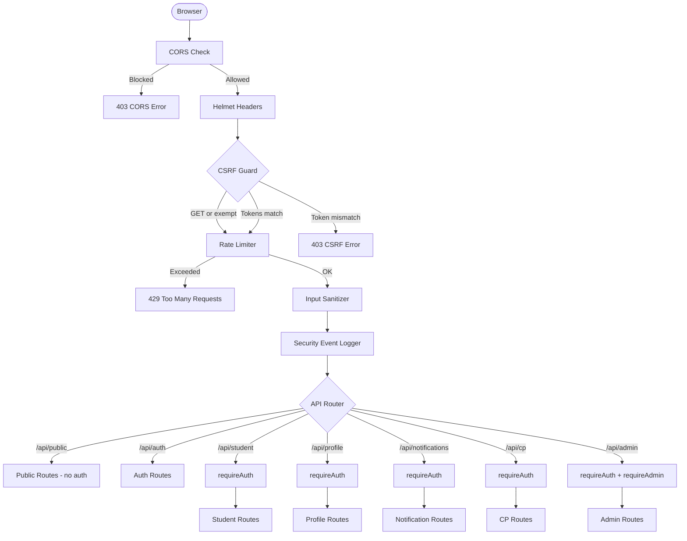
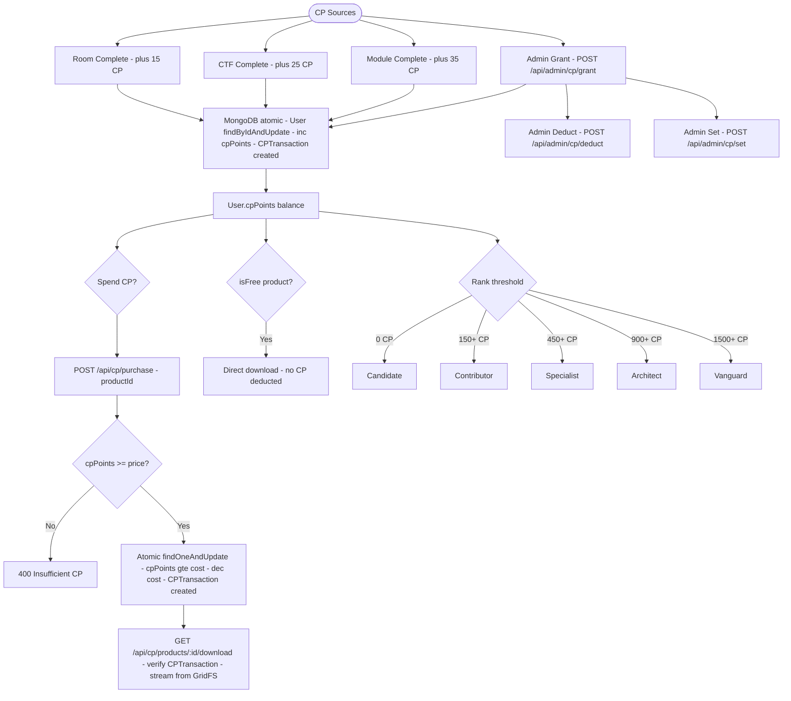
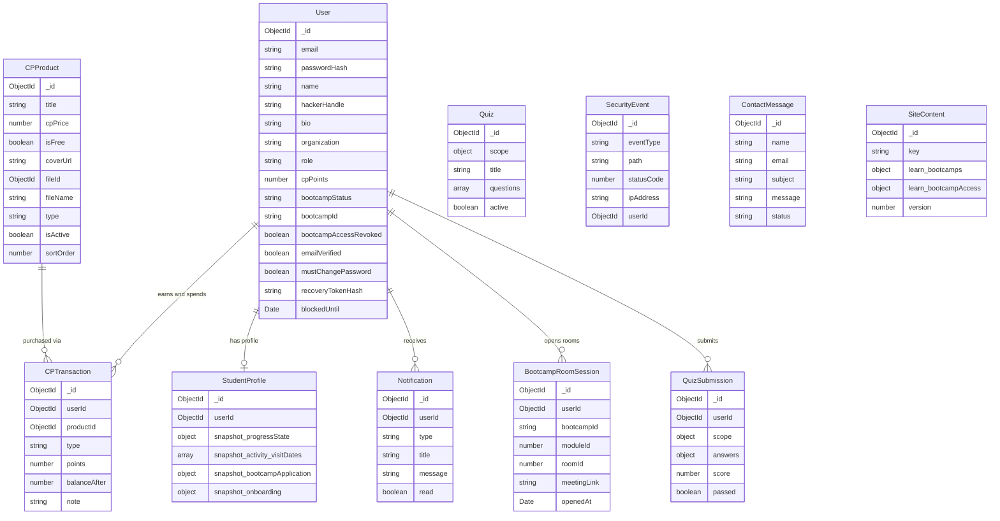
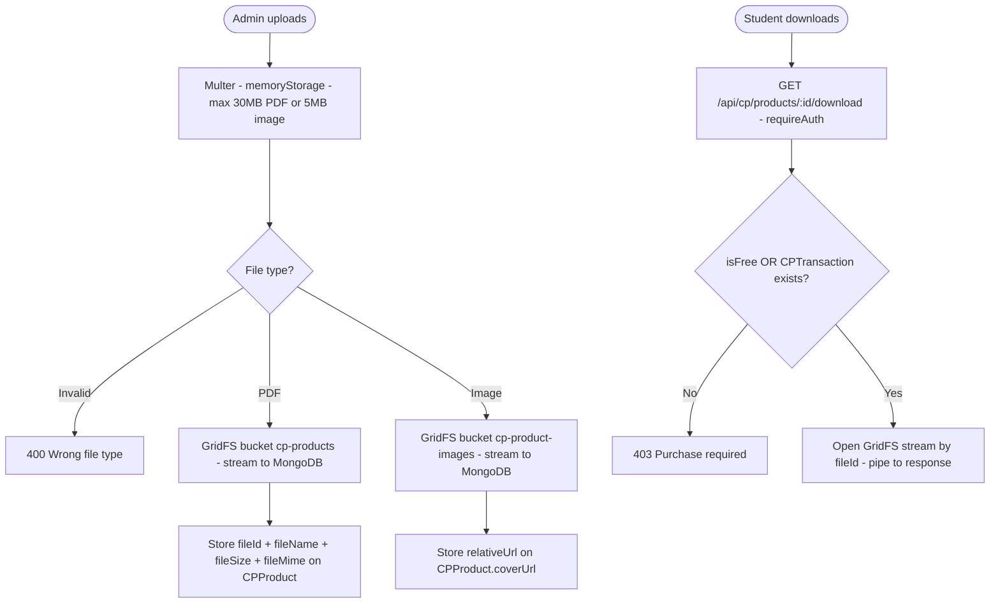
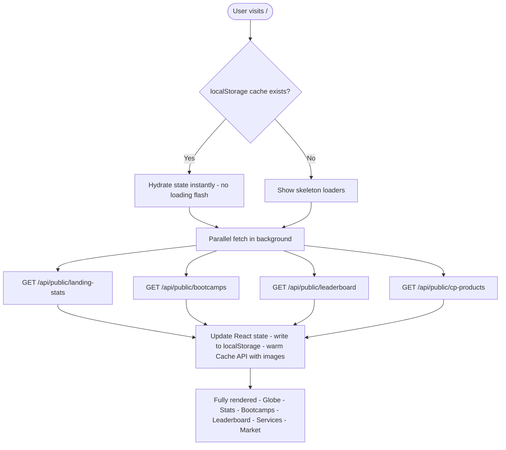

# HSOCIETY Platform — Full Architecture Flowchart

> Open in VS Code with **Markdown Preview Mermaid Support** installed.
> Press `Ctrl+Shift+V` to preview.

---

## 1. Request Lifecycle



---

## 2. Authentication Flow

```mermaid
flowchart TD
    V([Visitor]) --> CHOOSE{Action}

    CHOOSE -->|Register| REG[POST /api/auth/register]
    REG --> REG_VAL[Joi validation + handle uniqueness]
    REG_VAL -->|Fail| RE1[400 Validation Error]
    REG_VAL -->|Pass| REG_CREATE[Create User - bcrypt hash - recovery token]
    REG_CREATE --> REG_TOKENS[JWT 15min + Refresh 7d - httpOnly cookies - csrfToken]
    REG_TOKENS --> DASH[/dashboard]

    CHOOSE -->|Login| LOGIN[POST /api/auth/login]
    LOGIN --> LC{Valid credentials?}
    LC -->|No| LE1[401 - Log SecurityEvent]
    LC -->|Email unverified| LE2[403 verificationRequired]
    LC -->|mustChangePassword| LE3[Return passwordChangeToken]
    LE3 --> CPW[/change-password]
    LC -->|OK| LT[Issue JWT + Refresh + csrfToken]
    LT --> ROLE{Role?}
    ROLE -->|student| DASH
    ROLE -->|admin| ADASH[/mr-robot/dashboard]

    CHOOSE -->|Forgot password| FP[POST /api/auth/password-reset/request]
    FP --> FP_STORE[Generate JWT reset token - store SHA256 hash - 20min expiry]
    FP_STORE --> RC[POST /api/auth/password-reset/confirm]
    RC --> RCV{JWT valid + hash match?}
    RCV -->|No| RE2[401 Invalid token]
    RCV -->|Yes| RCS[bcrypt new password - clear reset token]
    RCS --> LOGIN

    CHOOSE -->|Refresh| RF[POST /api/auth/refresh - reads httpOnly cookie]
    RF --> RFC{Token valid + not revoked?}
    RFC -->|No| RFE[401 - clear cookies]
    RFC -->|Yes| RFN[New access token - rotate refresh]

    CHOOSE -->|Logout| LO[POST /api/auth/logout]
    LO --> LOC[Invalidate all refresh tokens - clear cookies]
    LOC --> HOME[/]

    CHOOSE -->|Verify email| VE[POST /api/auth/verify-email/confirm]
    VE --> VEC{Token valid?}
    VEC -->|No| VEE[401]
    VEC -->|Yes| VES[emailVerified = true]
    VES --> LOGIN
```

---

## 3. Frontend Route Map

```mermaid
flowchart TD
    BROWSER([Browser]) --> ROUTER{React Router}

    ROUTER --> PL[PublicLayout - Navbar + Footer]
    PL --> R1[/ - Landing Page]
    PL --> R2[/services]
    PL --> R3[/contact]
    PL --> R4[/cyber-points]
    PL --> R5[/leaderboard - paginated - localStorage cache]
    PL --> R6[/zero-day-market - public product listing]
    PL --> R7[/u/:handle - Public Operator Profile]

    ROUTER --> AL[No Layout - Auth Pages]
    AL --> A1[/login]
    AL --> A2[/register]
    AL --> A3[/forgot-password]
    AL --> A4[/reset-password]
    AL --> A5[/verify-email]
    AL --> A6[/change-password]
    AL --> A7[/mr-robot - admin login]

    ROUTER --> SL[StudentLayout - Topbar]
    SL --> SG{StudentOnly Guard}
    SG -->|Not logged in| SG1[Redirect /login]
    SG -->|Is admin| SG2[Redirect /mr-robot/dashboard]
    SG -->|Student OK| SP[Student Pages]

    SP --> S1[/dashboard]
    SP --> S2[/learn]
    SP --> S3[/bootcamps]
    SP --> S4[/bootcamps/:id - Course Page]
    SP --> S5[/marketplace]
    SP --> S6[/wallet]
    SP --> S7[/profile]
    SP --> S8[/notifications]
    SP --> S9[/settings]

    ROUTER --> ADML[AdminLayout]
    ADML --> AG{AdminOnly Guard}
    AG -->|Not admin| AG1[Redirect /dashboard]
    AG -->|Admin OK| AD1[/mr-robot/dashboard]
```

---

## 4. Student Learning Flow + CP Earning

```mermaid
flowchart TD
    STU([Student]) --> BP[/bootcamps - GET /api/public/bootcamps]
    BP --> BS{Bootcamp status?}
    BS -->|isActive false| LM[Locked Modal - launch date - Join WhatsApp]
    BS -->|Active - not enrolled| EM[Enrollment Modal - 5 steps]
    EM --> ES1[Step 1 - Why joining?]
    ES1 --> ES2[Step 2 - Current level?]
    ES2 --> ES3[Step 3 - 6-month goal?]
    ES3 --> ES4[Step 4 - Hours per week?]
    ES4 --> ES5[Step 5 - WhatsApp number]
    ES5 --> EAPI[POST /api/student/bootcamp - stores application in StudentProfile]
    EAPI --> COMM[Join WhatsApp Community]
    EAPI --> CP2[Course Page]

    BS -->|Enrolled| CP2[/bootcamps/:id - GET /api/student/course]

    CP2 --> MOD{Select Module}
    MOD -->|Locked by admin| ML[Locked - admin must unlock]
    MOD -->|Unlocked| ROOMS[Room cards grid]

    ROOMS --> RA{Room action}
    RA --> JS[Join Live Session - POST /api/student/modules/:id/rooms/:id/session-open - logs BootcampRoomSession]
    RA --> TQ[Take Quiz - POST /api/student/quiz]
    TQ --> QC{Quiz released by admin?}
    QC -->|No| QE[Quiz not available yet]
    QC -->|Yes| QM[Quiz Modal - multiple choice]
    QM --> QS[Submit - POST /api/student/quiz - returns score + passed]

    RA --> CR[Mark Room Complete - POST /api/student/modules/:id/rooms/:id/complete]
    CR --> CP_R[+15 CP - CPTransaction - Notification]
    CP_R --> CM{All rooms done?}
    CM -->|No| ROOMS
    CM -->|Yes| CTF[Complete CTF - POST /api/student/modules/:id/ctf/complete]
    CTF --> CP_C[+25 CP]
    CP_C --> CM2[Mark Module Complete - POST /api/student/modules/:id/complete]
    CM2 --> CP_M[+35 CP - rank recalculated - notification if rank changed]
    CP_M --> NM{More modules?}
    NM -->|Yes| MOD
    NM -->|No| DONE[Bootcamp Complete]
```

---

## 5. CP Economy Flow



---

## 6. Admin Dashboard Flow

```mermaid
flowchart TD
    ADM([Admin]) --> AL[POST /api/auth/login via /mr-robot]
    AL --> AD[/mr-robot/dashboard - loads overview + users + content + products + security + contacts + applications]

    AD --> T1[Users Tab]
    T1 --> T1A[Search and paginate users]
    T1 --> T1B[PATCH /api/admin/users/:id/block]
    T1 --> T1C[PATCH /api/admin/users/:id - bootcampAccessRevoked]
    T1 --> T1D[DELETE /api/admin/users/:id]

    AD --> T2[Bootcamps Tab]
    T2 --> T2A[Edit bootcamp JSON - PATCH /api/admin/content]
    T2 --> T2B[Edit modules - phases - rooms - meetingLink - readingContent]
    T2 --> T2C[Session Analytics - GET /api/admin/bootcamp/session-summary]
    T2 --> T2D[Release Quiz - POST /api/admin/bootcamp/quizzes/release]

    AD --> T3[Enrollment Applications Tab]
    T3 --> T3A[GET /api/admin/bootcamp-applications - why joined - level - goal - commitment - phone]

    AD --> T4[Zero-Day Market Tab]
    T4 --> T4A[POST /api/admin/cp-products - upload cover to GridFS - upload PDF to GridFS - isFree - cpPrice]
    T4 --> T4B[PATCH /api/admin/cp-products/:id]
    T4 --> T4C[DELETE /api/admin/cp-products/:id - deletes GridFS file]

    AD --> T5[Points Tab]
    T5 --> T5A[POST /api/admin/cp/grant]
    T5 --> T5B[POST /api/admin/cp/deduct]
    T5 --> T5C[POST /api/admin/cp/set]

    AD --> T6[Security Tab]
    T6 --> T6A[GET /api/admin/security/summary]
    T6 --> T6B[GET /api/admin/security/events - all 4xx/5xx with IP + path + userId]

    AD --> T7[Contacts Tab]
    T7 --> T7A[GET /api/admin/contact-messages]
    T7 --> T7B[PATCH status - new to in_progress to resolved to archived]
    T7 --> T7C[DELETE /api/admin/contact-messages/:id]
```

---

## 7. Data Models



---

## 8. Security Layers

```mermaid
flowchart LR
    subgraph T[Transport]
        TLS[TLS 1.3 HTTPS only]
        HSTS[HSTS 1 year preload]
    end

    subgraph A[Application]
        H[Helmet CSP X-Frame Referrer]
        C[CORS AllowedOrigins whitelist]
        CS[CSRF Double-Submit Cookie + Header]
        RL[Rate Limiting Auth 60/15min Public 600/15min API 300/15min]
        SI[Input Sanitizer Strip MongoDB operators]
    end

    subgraph AU[Auth]
        JW[JWT Access Token 15min memory only never localStorage]
        RT[Refresh Token 7d httpOnly cookie rotated on use]
        BC[bcrypt cost factor 12]
        RK[Recovery Token SHA-256 stored]
    end

    subgraph D[Data]
        AT[Atomic MongoDB ops inc for CP no race conditions]
        GF[GridFS file storage no direct filesystem]
        SE[SecurityEvent log all 4xx/5xx recorded]
    end

    T --> A --> AU --> D
```



---

## 9. File Upload Flow



---

## 10. Landing Page Cache Strategy


