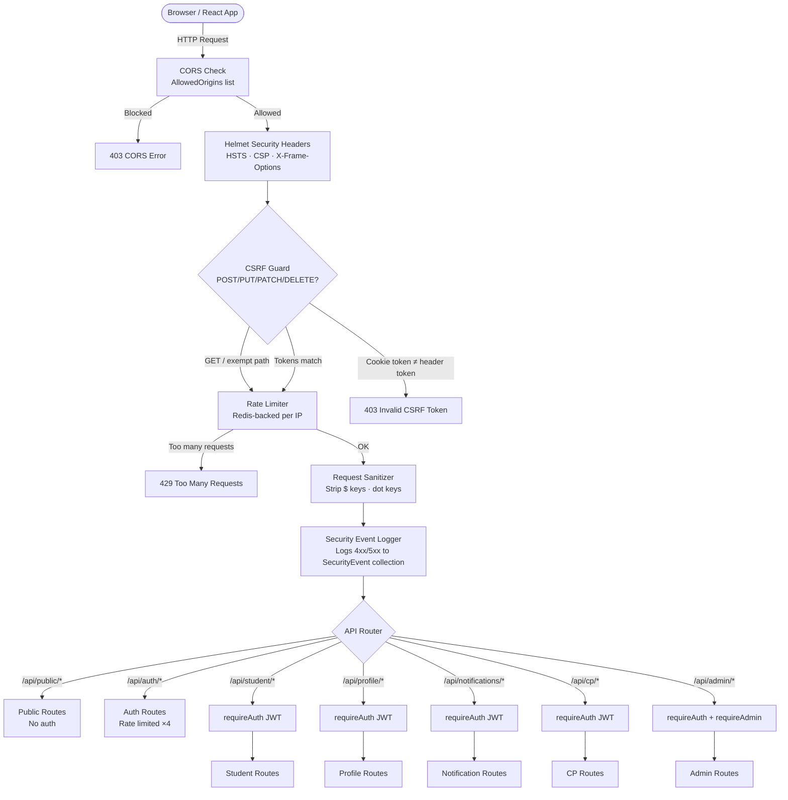
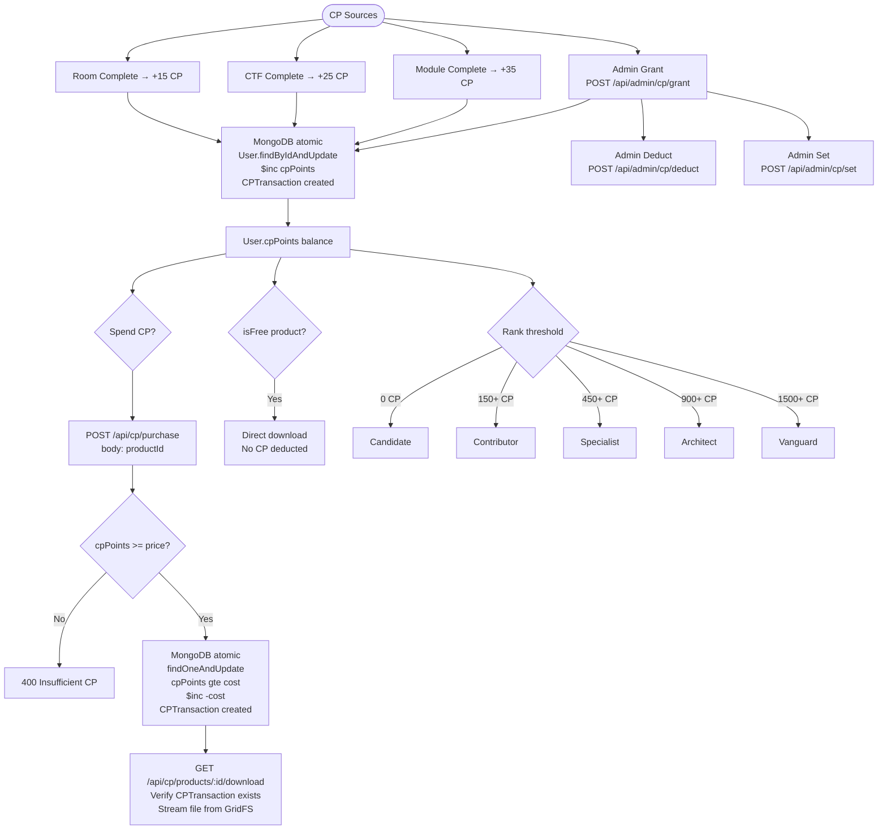
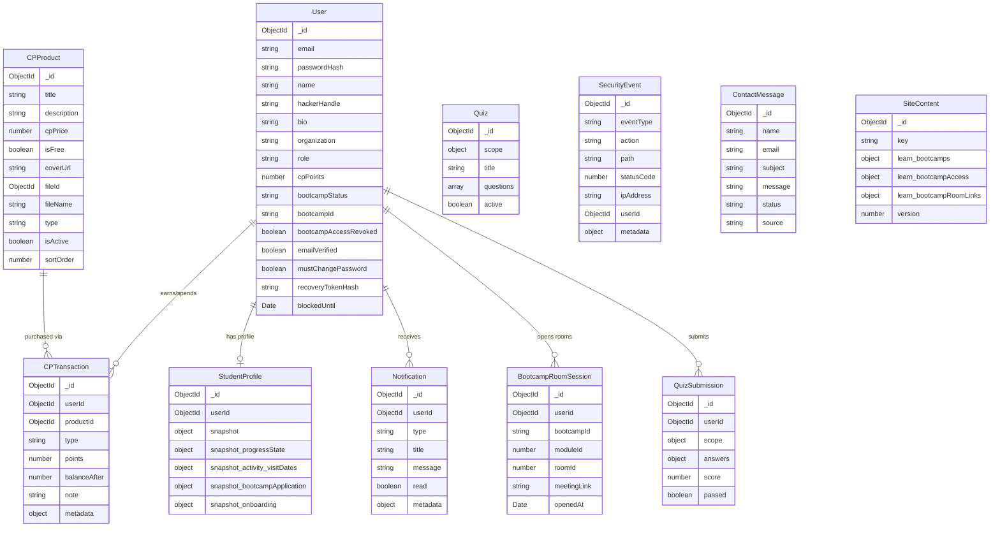
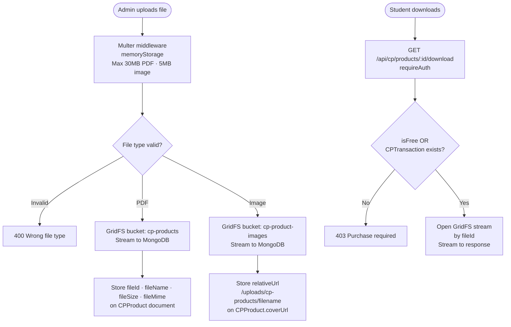
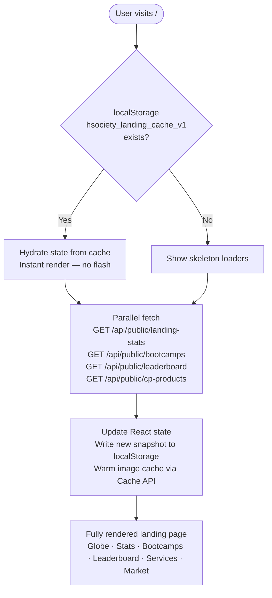

# HSOCIETY Platform — Full Architecture Flowchart

> Open this file in VS Code with the **Markdown Preview Mermaid Support** extension installed.
> Press `Ctrl+Shift+V` (or `Cmd+Shift+V` on Mac) to open the preview.

---

## 1. Request Lifecycle — Every API Call



---

## 2. Authentication Flow

```mermaid
flowchart TD
    VISITOR([Visitor]) --> CHOOSE{Which path?}

    CHOOSE -->|New user| REGISTER[POST /api/auth/register\nbody: email · password · handle · fullName]
    REGISTER --> REG_VALIDATE[Joi validation\nhandle uniqueness check\npassword strength check]
    REG_VALIDATE -->|Invalid| REG_ERR[400 Validation Error]
    REG_VALIDATE -->|Valid| REG_CREATE[Create User doc\nrole: student\nbcrypt hash password\ngenerate recovery token]
    REG_CREATE --> REG_TOKENS[Issue JWT access token 15m\n+ refresh token 7d\nSet httpOnly cookies\nReturn csrfToken]
    REG_TOKENS --> DASHBOARD[/dashboard]

    CHOOSE -->|Existing user| LOGIN[POST /api/auth/login\nbody: email · password]
    LOGIN --> LOGIN_CHECK{User exists?\nPassword matches?\nNot blocked?}
    LOGIN_CHECK -->|No| LOGIN_ERR[401 Invalid credentials\nLog SecurityEvent]
    LOGIN_CHECK -->|Email unverified| VERIFY_ERR[403 verificationRequired: true]
    LOGIN_CHECK -->|mustChangePassword| CHANGE_PWD_TOKEN[Return passwordChangeToken\nFrontend → /change-password]
    LOGIN_CHECK -->|OK| LOGIN_TOKENS[Issue JWT + refresh\nSet cookies + csrfToken]
    LOGIN_TOKENS --> ROLE{User role?}
    ROLE -->|student| DASHBOARD
    ROLE -->|admin| ADMIN_DASH[/mr-robot/dashboard]

    CHOOSE -->|Forgot password| FORGOT[POST /api/auth/password-reset/request\nbody: email]
    FORGOT --> FORGOT_STORE[Generate JWT reset token\nStore SHA-256 hash on User\nExpiry: 20 min]
    FORGOT_STORE --> RESET[POST /api/auth/password-reset/confirm\nbody: email · token · password]
    RESET --> RESET_VERIFY{JWT valid?\nHash matches?\nNot expired?}
    RESET_VERIFY -->|No| RESET_ERR[401 Invalid token]
    RESET_VERIFY -->|Yes| RESET_SAVE[bcrypt new password\nClear reset token]
    RESET_SAVE --> LOGIN

    CHOOSE -->|Token refresh| REFRESH[POST /api/auth/refresh\nReads httpOnly cookie]
    REFRESH --> REFRESH_CHECK{Refresh token valid?\nNot revoked?}
    REFRESH_CHECK -->|No| REFRESH_ERR[401 → Clear cookies → /login]
    REFRESH_CHECK -->|Yes| REFRESH_NEW[Issue new access token\nRotate refresh token]

    CHOOSE -->|Logout| LOGOUT[POST /api/auth/logout]
    LOGOUT --> LOGOUT_REVOKE[Invalidate all refresh tokens\nClear httpOnly cookies]
    LOGOUT_REVOKE --> HOME[/]
```

---

## 3. Frontend Route Map

```mermaid
flowchart TD
    BROWSER([Browser]) --> ROUTER{React Router\nAnimatePresence}

    ROUTER --> PUBLIC_LAYOUT[PublicLayout\nNavbar + Footer]
    PUBLIC_LAYOUT --> PUB_LANDING[/ Landing Page\nGlobe · Stats · Bootcamps · Leaderboard · Services]
    PUBLIC_LAYOUT --> PUB_SERVICES[/services\nServices Page + Hero]
    PUBLIC_LAYOUT --> PUB_CONTACT[/contact\nContact Form → POST /api/public/contact]
    PUBLIC_LAYOUT --> PUB_CP[/cyber-points\nCP explainer page]
    PUBLIC_LAYOUT --> PUB_LEADERBOARD[/leaderboard\nGET /api/public/leaderboard\nPaginated · Cached localStorage]
    PUBLIC_LAYOUT --> PUB_MARKET[/zero-day-market\nGET /api/public/cp-products\nPublic product listing]
    PUBLIC_LAYOUT --> PUB_PROFILE[/u/:handle\nGET /api/public/users/:handle\nPublic operator profile]

    ROUTER --> AUTH_PAGES[No Layout\nAuth Pages]
    AUTH_PAGES --> AUTH_LOGIN[/login · /register\n/forgot-password · /reset-password\n/verify-email · /change-password\n/mr-robot admin login]

    ROUTER --> STUDENT_LAYOUT[StudentLayout\nTopbar + Bottom Nav]
    STUDENT_LAYOUT --> AUTH_GUARD{StudentOnly guard\nrequireAuth}
    AUTH_GUARD -->|Not logged in| REDIRECT_LOGIN[→ /login]
    AUTH_GUARD -->|Is admin| REDIRECT_ADMIN[→ /mr-robot/dashboard]
    AUTH_GUARD -->|Student OK| STUDENT_PAGES

    STUDENT_PAGES --> STU_DASH[/dashboard\nOverview · Progress · Quick Actions]
    STUDENT_PAGES --> STU_LEARN[/learn\nBootcamp listing with progress]
    STUDENT_PAGES --> STU_BOOTCAMPS[/bootcamps\nBootcamp cards\nEnroll → Questionnaire Modal]
    STUDENT_PAGES --> STU_COURSE[/bootcamps/:id\nCourse page · Modules · Rooms · CTF · Quiz]
    STUDENT_PAGES --> STU_MARKET[/marketplace\nCP products · Purchase · Download]
    STUDENT_PAGES --> STU_WALLET[/wallet\nBalance · Transaction history]
    STUDENT_PAGES --> STU_PROFILE[/profile\nEdit profile · Public profile link]
    STUDENT_PAGES --> STU_NOTIF[/notifications\nRead · Mark all read]
    STUDENT_PAGES --> STU_SETTINGS[/settings\nChange password · Recovery token]

    ROUTER --> ADMIN_LAYOUT[AdminLayout]
    ADMIN_LAYOUT --> ADMIN_GUARD{AdminOnly guard}
    ADMIN_GUARD -->|Not admin| REDIRECT_DASH[→ /dashboard]
    ADMIN_GUARD -->|Admin OK| ADMIN_DASH[/mr-robot/dashboard\n6 tabs]
```

---

## 4. Student Learning Flow + CP Earning

```mermaid
flowchart TD
    STU([Student]) --> BOOTCAMP_PAGE[/bootcamps\nGET /api/public/bootcamps]
    BOOTCAMP_PAGE --> BC_STATUS{Bootcamp status?}
    BC_STATUS -->|isActive false| LOCKED_MODAL[Locked Modal\nLaunch date · Join Community WhatsApp]
    BC_STATUS -->|Active + not enrolled| ENROLL_MODAL[Enrollment Questionnaire Modal\n5 steps: motivation · level · goal · commitment · phone]
    ENROLL_MODAL --> ENROLL_API[POST /api/student/bootcamp\nbody: bootcampId · application\nStores in StudentProfile.snapshot.bootcampApplication]
    ENROLL_API --> COMMUNITY[Join WhatsApp Community\nSuccess screen]
    ENROLL_API --> COURSE_PAGE

    BC_STATUS -->|Enrolled| COURSE_PAGE[/bootcamps/:id\nGET /api/student/course?bootcampId=X\nGET /api/student/overview]

    COURSE_PAGE --> MODULE{Select Module}
    MODULE -->|Locked by admin| LOCKED_ROOM[🔒 Locked — admin must unlock]
    MODULE -->|Unlocked| ROOM_LIST[Room cards grid]

    ROOM_LIST --> ROOM_ACTIONS{Room actions}
    ROOM_ACTIONS --> JOIN_SESSION[Join Live Session\nPOST /api/student/modules/:id/rooms/:id/session-open\nOpens meetingLink · Logs BootcampRoomSession]
    ROOM_ACTIONS --> TAKE_QUIZ[Take Quiz\nPOST /api/student/quiz\nbody: type·room · id · moduleId · courseId]
    TAKE_QUIZ --> QUIZ_CHECK{Quiz released\nby admin?}
    QUIZ_CHECK -->|No| QUIZ_ERR[Quiz not available yet]
    QUIZ_CHECK -->|Yes| QUIZ_MODAL[Quiz Modal\nMultiple choice · Submit answers]
    QUIZ_MODAL --> QUIZ_SUBMIT[POST /api/student/quiz\nbody: scope · answers\nReturns score · passed]

    ROOM_ACTIONS --> COMPLETE_ROOM[Mark Room Complete\nPOST /api/student/modules/:id/rooms/:id/complete]
    COMPLETE_ROOM --> CP_ROOM[+15 CP\nCPTransaction created\nNotification emitted]
    CP_ROOM --> CHECK_MODULE{All rooms done?}
    CHECK_MODULE -->|No| ROOM_LIST
    CHECK_MODULE -->|Yes| COMPLETE_CTF[Complete CTF\nPOST /api/student/modules/:id/ctf/complete]
    COMPLETE_CTF --> CP_CTF[+25 CP]
    CP_CTF --> COMPLETE_MODULE[Mark Module Complete\nPOST /api/student/modules/:id/complete]
    COMPLETE_MODULE --> CP_MODULE[+35 CP\nRank recalculated\nNotification if rank changed]
    CP_MODULE --> NEXT_MODULE{More modules?}
    NEXT_MODULE -->|Yes| MODULE
    NEXT_MODULE -->|No| BOOTCAMP_DONE[Bootcamp Complete 🎉]
```

---

## 5. CP Economy Flow



---

## 6. Admin Dashboard Flow

```mermaid
flowchart TD
    ADMIN([Admin]) --> ADMIN_LOGIN[POST /api/auth/login\n/mr-robot route]
    ADMIN_LOGIN --> ADMIN_DASH[/mr-robot/dashboard\nGET /api/admin/overview\nGET /api/admin/users\nGET /api/admin/content\nGET /api/admin/cp-products\nGET /api/admin/security/summary\nGET /api/admin/contact-messages\nGET /api/admin/bootcamp-applications]

    ADMIN_DASH --> TAB_USERS[Users Tab]
    TAB_USERS --> USER_SEARCH[Search · Paginate]
    TAB_USERS --> USER_BLOCK[PATCH /api/admin/users/:id/block]
    TAB_USERS --> USER_REVOKE[PATCH /api/admin/users/:id\nbootcampAccessRevoked]
    TAB_USERS --> USER_DELETE[DELETE /api/admin/users/:id]

    ADMIN_DASH --> TAB_BOOTCAMPS[Bootcamps Tab]
    TAB_BOOTCAMPS --> BC_EDIT[Edit bootcamp JSON\nPATCH /api/admin/content\nlearn.bootcamps array]
    TAB_BOOTCAMPS --> BC_MODULES[Edit modules JSON\nphases · rooms · meetingLink\nreadingContent · readingLinks]
    TAB_BOOTCAMPS --> BC_ANALYTICS[Session Analytics\nGET /api/admin/bootcamp/session-summary\nRoom open counts · Participation]
    TAB_BOOTCAMPS --> BC_QUIZ[Release Room Quiz\nPOST /api/admin/bootcamp/quizzes/release\nScope: room · moduleId · roomId]

    ADMIN_DASH --> TAB_APPS[Enrollment Applications Tab]
    TAB_APPS --> APPS_LIST[GET /api/admin/bootcamp-applications\nWhy joined · Level · Goal · Commitment · Phone]

    ADMIN_DASH --> TAB_MARKET[Zero-Day Market Tab]
    TAB_MARKET --> PROD_CREATE[POST /api/admin/cp-products\nUpload cover image → GridFS\nUpload PDF → GridFS\nisFree flag · cpPrice · type]
    TAB_MARKET --> PROD_EDIT[PATCH /api/admin/cp-products/:id]
    TAB_MARKET --> PROD_DELETE[DELETE /api/admin/cp-products/:id\nDeletes GridFS file too]

    ADMIN_DASH --> TAB_CP[Points Tab]
    TAB_CP --> CP_GRANT[POST /api/admin/cp/grant]
    TAB_CP --> CP_DEDUCT[POST /api/admin/cp/deduct]
    TAB_CP --> CP_SET[POST /api/admin/cp/set]

    ADMIN_DASH --> TAB_SECURITY[Security Tab]
    TAB_SECURITY --> SEC_SUMMARY[GET /api/admin/security/summary]
    TAB_SECURITY --> SEC_EVENTS[GET /api/admin/security/events\nAll 4xx/5xx logged with IP · path · userId]

    ADMIN_DASH --> TAB_CONTACTS[Contacts Tab]
    TAB_CONTACTS --> CONTACT_LIST[GET /api/admin/contact-messages]
    TAB_CONTACTS --> CONTACT_STATUS[PATCH /api/admin/contact-messages/:id\nnew → in_progress → resolved → archived]
    TAB_CONTACTS --> CONTACT_DELETE[DELETE /api/admin/contact-messages/:id]
```

---

## 7. Data Models (MongoDB Collections)



---

## 8. Security Layers

```mermaid
flowchart LR
    subgraph TRANSPORT[Transport Layer]
        TLS[TLS 1.3\nHTTPS only]
        HSTS[HSTS\n1 year preload]
    end

    subgraph APP[Application Layer]
        HELMET[Helmet\nCSP · X-Frame · Referrer]
        CORS[CORS\nAllowedOrigins whitelist]
        CSRF[CSRF Double-Submit\nCookie + Header token]
        RATE[Rate Limiting\nAuth: 60/15min\nPublic: 600/15min\nAPI: 300/15min]
        SANITIZE[Input Sanitizer\nStrip MongoDB operators\nStrip dot-notation keys]
    end

    subgraph AUTH[Auth Layer]
        JWT[JWT Access Token\n15min · memory only\nnever localStorage]
        REFRESH[Refresh Token\n7 days · httpOnly cookie\nRotated on use]
        BCRYPT[bcrypt password hash\ncost factor 12]
        RECOVERY[Recovery Token\nSHA-256 stored\nAcknowledge flow]
    end

    subgraph DATA[Data Layer]
        ATOMIC[Atomic MongoDB ops\n$inc for CP\nNo race conditions]
        GRIDFS[GridFS file storage\nNo direct filesystem access]
        AUDIT[SecurityEvent log\nAll 4xx/5xx recorded]
    end

    TRANSPORT --> APP --> AUTH --> DATA
```



---

## 9. File Upload Flow (GridFS)



---

## 10. Landing Page Data Cache


